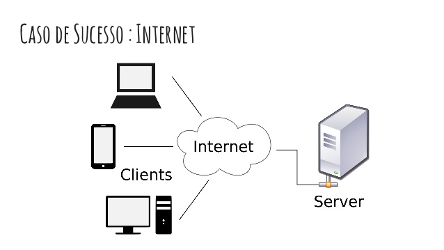
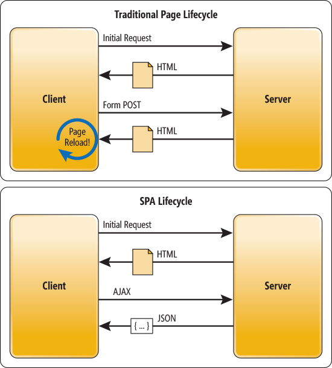
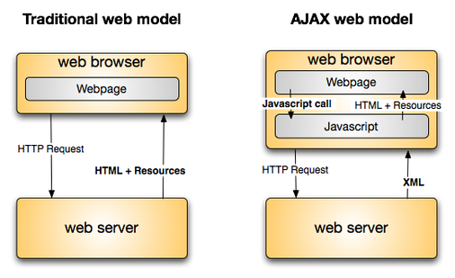
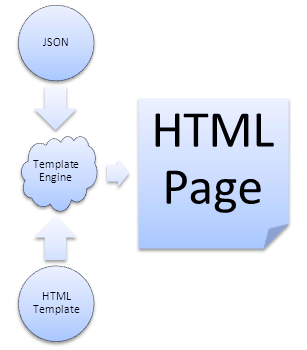
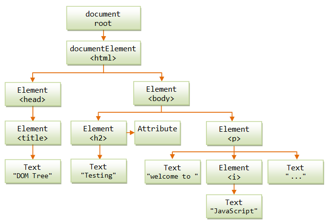
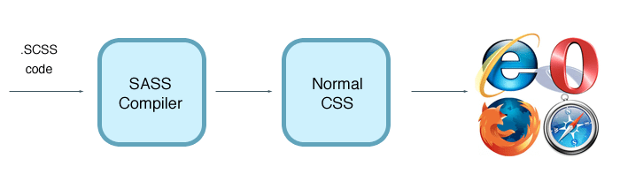
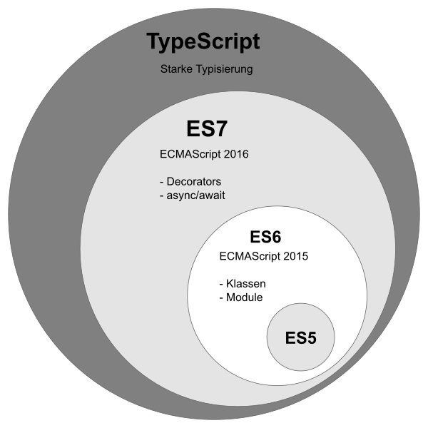
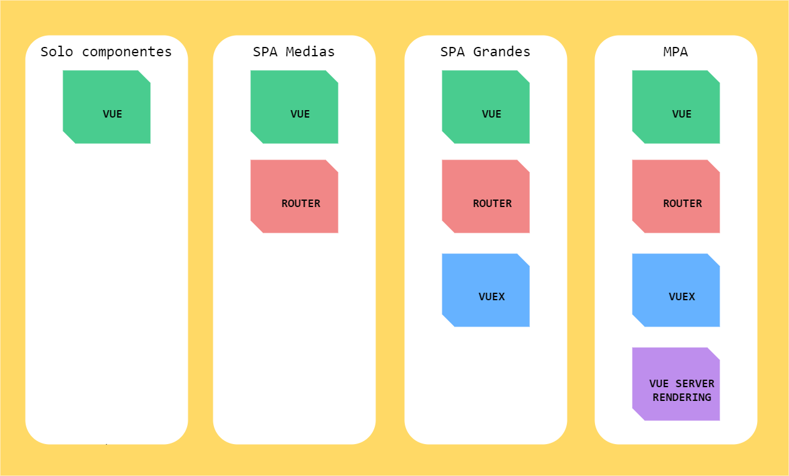

# Clase 1

## Normas e información de interés

* Puntualidad
* Líquidos y comida
* Ubicación
* Cafetería, cajeros, farmacias, etc...

## Metodología

* Descansos
* Gestión del curso en GitHub
* Comunicación fuera de clase
* Repositorio común
* Teoría, prácticas y recursos

## Sobre el profesor

* Soy Jose Dongil
* Desarrollo cosas varias para la **Web**
* Trabajo en **BBVA Next Technologies**
* Me encanta el **Front y JavaScript**
* Estoy siempre disponible en **@jdonsan**

## Planning del día 

1. Introducción a VueJS
2. TODO List sin VueJS
3. Cómo empezar con VueJS
4. Nuestro primer Hello World en VueJS
5. TODO List con VueJS

# 1. Introducción a VueJS

## **Aviso!!** Cuidado con la Fatiga Front 

## ¿Cómo hemos llegado hasta aquí?

Me gusta dividir la historía de las herramientas JS
en **3 etapas o generaciones**

* 1ª generación:

    - Primeras librerías JavaScript que nos permiten enriquecer 
      nuestras Webs con elementos dinámicos
    - Nos permiten desarrollos X-Browser
    - Nos facilitan la integración con servidores
    - Algunas de ellas son: jQuery o Mootools

* 2ª generación: 
    - Las aplicaciones en el lado del cliente empiezan a crecer y 
      las librerías anteriores se nos quedan cortas
    - Nacen frameworks con funcionalidades nuevas que mejoran la productividad
    - Intentan estructurar y abstraer nuestro código
    - Algunas de ellos son: AngularJS y BackboneJS

* 3ª generación:
    - Las anteriores herramientas pecan de ser monolíticas y poco agiles
    - Nacen ecosistemas bien modularizados y flexibles que nos permiten 
      añadir piezas a nuestro código poco a poco.
    - Algunos de estos ecosistemas son: Angular, ReactJS y VueJS

## ¿Por qué VueJS? 

Conozcamos a su creador y su historia:

* Evan You es un desarrollador de nacionalidad china
* Ha desarrollado en compañías como Google
* Y ha participado en proyectos como AngularJS y MeteorJS
* Evan You necesitaba una herramienta de render más ligera y rápida que AngularJS, así que empezó a trabajar en su propia herramienta, nacía VueJS.

## Detengámonos un momento

Para crear un vocabulario común entre los alumnos, vamos a recordar o explicar algunos conceptos base de lo que a día de hoy necesitamos para entender qué es mundo front en nuestro día a día

### **Cliente vs Servidor**

### **SPA vs MPA**

### **AJAX**

### **Render**

### **DOM y HTML**

### **Preprocesadores**

### **Transpiladores**

## ¿Qué es VueJS?

* Framework JavaScript
* Nos permite crear aplicaciones SPA o MPA
* Versátil: nos permite usarlo en Web, móvil o Escritorio
* Orientado a componentes
* Los componentes usan MVVM
* Orientado al dato

## ¿Qué es desarrollo orientado a componentes en Web?

## ¿Los componentes usan MVVM?

## Pero... ¿por qué VueJS? ¿Por qué estamos aprendíendolo hoy?

### **Fácil de usar**: API sencilla y simple

Un componente en vue está formado por esto:

* **Aprendizaje y uso progresivo**: usa lo que necesites
* **Modular**: código reutilizable y fácil de probar
* **Orientado a negocio**: arquitectura robusta, céntrate en desarrollar lo que necesitas
* **Trabajo entre diferentes perfiles**: Nos permite a maquetadores y programadores trabajar juntos con un lenguaje común.
* **Concenciado con los estándar** y las últimas técnicas Web.
* **Mucha comunidad y activa**: todo son herramienta Full Open Source
* **Ligero y rápido**: es una librería pequeña y muy optimizada
* **Muchas herramientas** para mejorar la experiencia de desarrollo

## ¿Framework o librería?

Mejor llamémoslo ecosistema. Existe tal cantidad d elibrerías y utilidades que el ciclo de vida del softaware se encuentra cubierto gracias a Vue. Solo tenemos que mirar en **Awesome Vue** para darnos cuenta de la cantidad de información y ayuda que hay:

* [Awesome Vue](https://github.com/vuejs/awesome-vue)

Aprovechemos e instalemos dos de las herramientas con las que vamos a trabajar por el momento:

  * [Visual Studio Code + Vetur](https://marketplace.visualstudio.com/items?itemName=octref.vetur)
  * [Google Chrome + Vue Dev Tools](https://chrome.google.com/webstore/detail/vuejs-devtools/nhdogjmejiglipccpnnnanhbledajbpd?hl=es)

## Diferentes partes del framework

Vue está modularizado. De esta forma, solo te tienes que preocupar por añadir aquellos recursos que tu necesites. Mira la imágen:

Depediendo de cómo vaya creciendo tu aplicación, necesitaremos más o menos funcionalidad extra. 

Por ejemplo, si me encuentro **desarrollando una aplicación simple con muy poca carga lógica, pero mucha carga visual** donde pueda reutilizar muchas partes, solo incluiremos `vue` como librería.

Sin embargo, si nuestra **aplicación empieza a crecer (imaginemos que queremos hacer un pequeño backoffice)**, necesitaremos gestionar, además de componentes visuales, diferentes pantallas y estados por los que pasará el usuario es ahí donde `vue-router`.

Si nuestra aplicación sigue creciendo, cada vez **gestionaremos mayor cantidad de información, nos integraremos a varias APIS o incluso muchos componentes empezarán a comunicarse entre sí**, necesitaremos incluir `vuex`.

La cosa no termina ahí, imaginate que estamos creando una **gran tienda online donde el SEO y la velocidad es clave para conseguir ventas**. Sería buena idea que pudieramos compilar y renderizar nuestras vistas en el lado del servidor. `vue-server-rendering` nos ayudará a conseguirlo

## Diferentes partes de la librería
