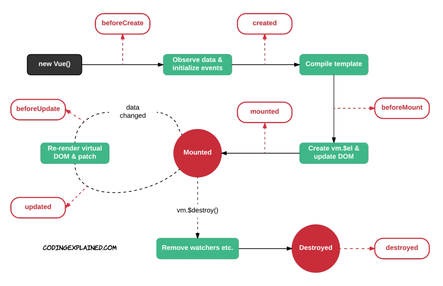

# Clase 2

## Planning del día

* Repaso clase anterior
* Ciclo de vida de un componente de Vue
* Realizar nuestra primera llamada AJAX
* Renderizando modelos por pantalla
* Ejercicio "Mostrando datos de una API"
* Renderizando estilos por pantalla
* Ejercicio "El juego de la bandera"

# 1. El ciclo de vida de un componente

Todo componente (ya sea el componente raiz o instancia o un subcomponente) tiene un determinado ciclo de vida basado en 4 fase:

* Creación
* Montaje
* Actualización
* Destrucción

Cada fase tiene sus dos hooks correspondientes. Un hook, o garfio (:S), es un momento especifico dentro del ciclo de vida de un componente donde vue nos deja ejecutar funcionalidad. Dependiendo de en que fase del ciclo nos encontremos, tendremos acceso a unas cosas u otras y realizaremos unas acciones especificas. 

Si cada fase del ciclo tiene dos hooks, significa que tenemos 8 momentos para ejecutrar funcionalidad dentro de un componente. 

Podemos ver el ciclo completo en este diagrama:



## 1.1. **Creación** de un componente

Un componente cuenta con un estado de creación. Este estado se produce entre la instanciación y el montaje del elemento en el DOM. Cuenta con dos hooks:

### 1.1.1. beforeCreate

Este hook se realiza nada más instanciar un componente. Durante este hook no tiene sentido acceder al estado del componente pues todavía no se han registrado los observadores de los datos, ni se han registrado los eventos.

Aunque pueda parecer poco útil, utilizar este hook puede ser es un buen momento para dos acciones en particular:

1. **Para configurar ciertos parámetros internos u opciones, inherentes a las propias funcionalidad de VueJS**. Un caso de uso común es cuando queremos evitar  referencias circulares entre componentes. Cuando usamos una herramienta de empaquetado de componentes, podemos entrar en bucle infinito por culpa de dichas referencias. Para evitar esto, podemos cargar el componente de manera ‘diferida’ para que el propio empaquetador no se vuelva loco.

```js
const component1 = {
    beforeCreate: function () {
        this.$options.components.Component2 
            = require('./component2.vue');
    }
};
````

2. **Para iniciar librerías o estados externos**. Por ejemplo, imaginemos que queremos iniciar una colección en localSotrage para realizar un componente con posibilidad de guardado offline. Podríamos hacer lo siguiente:

```js
const component = {
    destroyed: function () {
        localStorage.setItem('tasks', []);
    }
};
```

### 1.1.2. created

Cuando se ejecuta este hook, el componente acaba de registrar tanto los observadores como los eventos, pero todavía no ha sido ni renderizado ni incluido en el DOM. Por tanto, tenemos que tener en cuenta que dentro de created no podemos acceder a $el porque todavía no ha sido montado.

Es uno de los más usados y nos viene muy bien para iniciar variables del estado de manera asíncrona. Por ejemplo, necesitamos que un componente pinte los datos de un servicio determinado. Podríamos hacer algo como esto:

```js
const component = {
    created: function () { 
        axios.get('/tasks') 
            .then(response => this.tasks = response.data) 
            .catch(error => this.errors.push(error));
    }
};
```


## 1.2. **Montaje** de un componente

Una vez que el componente se ha creado, podemos entrar en una fase de montaje, es decir que se renderizará e insertará en el DOM. Puede darse el caso que al instanciar un componente no hayamos indicado la opción el. De ser así, el componente se encontraría en estado creado de manera latente hasta que se indique o hasta que ejecutemos el método $mount que lo que provocará es que el componente se renderice, pero no se monte (el montaje sería manual).

### 1.2.1. beforeMount
Se ejecuta justo antes de insertar el componente en el DOM, justamente, en tiempo de la primera renderización de un componente. Es uno de los hooks que menos usarás y, como muchos otros, se podrá utilizar para trazar el ciclo de vida del componente.

A veces se usa para iniciar variables, pero yo te recomiendo que delegues esto al hook created.

### 1.2.2. mounted
Es el hook que se ejecuta nada más renderizar e incluir el componente en el DOM. Nos puede ser muy útil para inicializar librerías externas. Imagínate que estás haciendo uso, dentro de un componente de VueJS, de un plugin de jQuery. Puede ser buen momento para ejecutar e iniciarlo en este punto, justamente cuando acabamos de incluirlo al DOM.

Lo usaremos mucho porque es un hook que nos permite manipular el DOM nada más iniciarlo. Un ejemplo sería el siguiente. Dentro de un componente estoy usando el plugin buttonde jQuery  UI (Imaginemos que es un proyecto legado y no me queda otra). Podríamos hacer esto:

```js
const component = {
    mounted: function () {
        $(".selector").button({});
    }
};
```

## 1.3. **Actualización** de un componente

Cuando un componente ha sido creado y montado se encuentra a disposición del usuario. Cuando un componente entra en interacción con el usuario pueden darse eventos y cambios de estados. Estos cambios desembocan la necesidad de tener que volver a renderizar e incluir las diferencias provocadas dentro del DOM de nuevo. Es por eso, que el componente entra en un estado de actualización que también cuenta con dos hooks.

### 1.3.1. beforeUpdate

Es el hook que se desencadena nada más que se provoca un actualización de estado, antes de que se se comience con el re renderizado del Virtual DOM y su posterior ‘mapeo’ en el DOM real.

Este hook es un buen sitio para trazar cuándo se provocan cambios de estado y se desembocan renderizados que nosotros no preveíamos o que son muy poco intuitivos a simple vista. Podríamos hacer lo siguiente:

```js
const component = {
    beforeUpdate: function () {
        console.log('Empieza un nuevo renderizado de component');
    }
};
```

Puedes pensar que es un buen sitio para computar o auto calcular estados a partir de otros, pero esto es desaconsejado. Hay que pensar que estos hooks son todos asíncronos, lo que significa que si su algoritmo interno no acaba, el componente no puede terminar de renderizar de nuevo los resultados. Con lo cual,cuidado con lo que hacemos internamente de ellos. Si necesitamos calcular cómputos, contamos con funcionalidad específica en VueJS por medio de Watchers o Computed properties.

### 1.3.2. updated

Se ejecuta una vez que el componente ha re renderizado los cambios en el DOM real. Al igual que ocurría con el hook mounted es buen momento para hacer ciertas manipulaciones del DOM externas a VueJS o hacer comprobaciones del estado de las variables en ese momento.

Puede que tengamos que volver a rehacer un componente que tenemos de jQuery, Aquí puede ser buen momento para volver a lanzarlo y hacer un refresh o reinit:

```js
const component = {
    updated: function () {
        $(".selector").button("refresh");
    }
};
````

## 1.4. **Destrucción** de un componente

Un componente puede ser destruido una vez que ya no es necesario para el usuario. Esta fase de desencadena cuando queremos eliminarlo del DOM y destruir la instancia de memoria.

### 1.4.1. beforeDestroy

Se produce justamente antes de eliminar la instancia. El componente es totalmente operativo todavía y podemos acceder tanto al estado interno, como a sus propiedades y eventos.

Suele usarse para quitar eventos o escuchadores . Por ejemplo:

```js
const component = {
    beforeDestroy: function () {
        document.removeEventListener('keydown', this.onKeydown);
    }
};
```

### 1.4.2. destroyed

Tanto los hijos internos, como las directivas, como sus eventos y escuchadores han sido eliminados. Este hook se ejecuta cuando la instancia ha sido eliminada. Nos puede ser muy útil para limpiar estados globales de nuestra aplicación.

Si antes habíamos iniciado el localStorage con una colección para dar al componente soporte offline, ahora podríamos limpiar dicha colección:

```js
const component = {
    destroyed: function () {
        localStorage.removeItem('tasks');
    }
};
```
# 2. Renderizando modelos por pantalla

## 2.1. Interpolaciones

### 2.1.1. Interpolando texto


```html
<span>Mensaje: {{ msg }}</span>
```

### 2.1.2. Interpolando html

```html
<p>Usando mustaches: {{ rawHtml }}</p>
<p>Usando la directiva v-html: <span v-html="rawHtml"></span></p>
```

> TIP: Cuidado con renderizar HTML que no controlemos. Esto puede ser una vulnerabilidad del sistema


### 2.1.3. Interpolando atributos
```html
<div v-bind:id="dynamicId"></div>
```

```html
<button v-bind:disabled="isButtonDisabled">Button</button>
```

### 2.1.4. Usando expresiones JavaScript 

```html
{{ number + 1 }}

{{ ok ? 'YES' : 'NO' }}

{{ message.split('').reverse().join('') }}

<div v-bind:id="'list-' + id"></div>
```

Esto no funciona

```html
<!-- Esto es una asignación, no una expresión: -->
{{ var a = 1 }}

<!-- Los controles de flujo no funcionan, pero si una expresión ternaria -->
{{ if (ok) { return message } }}
```

## 2.2. Directivas

```html
<p v-if="seen">Ahora me ves</p>
```

### 2.2.1. Argumentos

```html
<a v-bind:href="url"> ... </a>
```

```html
<a v-on:click="doSomething"> ... </a>
```

### 2.2.2. Modificadores

```html
<form v-on:submit.prevent="onSubmit"> ... </form>
```

### 2.2.3. Shorthands

```html
<!-- sintaxis completa -->
<a v-bind:href="url"> ... </a>

<!-- shorthand -->
<a :href="url"> ... </a>
```


```html
<!-- sintaxis completa -->
<a v-on:click="doSomething"> ... </a>

<!-- shorthand -->
<a @click="doSomething"> ... </a>
```

## 2.3. Manejador de eventos

### 2.3.1. Manejar un evento con una expresión

```html
<div id="my-example-1">
  <button v-on:click="counter += 1">Añade 1</button>
  <p>EL botón ha sido pulsado {{ counter }} veces.</p>
</div>
```

```js
var example1 = new Vue({
  el: '#my-example-1',

  data: {
    counter: 0
  }
})
```

### 2.3.2. Manejar un evento con un método

```html
<div id="my-example-2">

  <button v-on:click="greet">Saludar!!</button>
</div>
```

```js
var example2 = new Vue({
  el: '#my-example-2',

  data: {
    name: 'Vue.js'
  },

  methods: {
    greet: function (event) {
      alert('Hola ' + this.name + '!')
      
      // event es un evento nativo del DOM
      if (event) {
        alert(event.target.tagName)
      }
    }
  }
})

// Puedes invocar el método tambien
example2.greet() // => 'Hola Vue.js!'
```

### 2.3.3. Manejar un evento con un método inline

```html
<div id="my-example-3">
  <button v-on:click="say('Hola')">Dime Hola!!</button>
  <button v-on:click="say('Qué')">Dime Qué!!</button>
</div>
```

```js
new Vue({
  el: '#my-example-3',
  methods: {
    say: function (message) {
      alert(message)
    }
  }
})
```

### 2.3.4. Modificadores para eventos

Antes de empezar es importante saber la diferencia entre `stopPropagation` y `preventDefault` 

[stopPropagation](https://codepen.io/felquis/pen/oXYdEz)

```html
<!-- Se detiene la propagación del evento -->
<a v-on:click.stop="doThis"></a>

<!-- el evento submit event no recargará la página (evento por defecto) -->
<form v-on:submit.prevent="onSubmit"></form>

<!-- podemos concatenar modificadores -->
<a v-on:click.stop.prevent="doThat"></a>

<!-- solo incluímos el modificador -->
<form v-on:submit.prevent></form>

<!-- use capture mode when adding the event listener -->
<!-- i.e. an event targeting an inner element is handled here before being handled by that element -->
<div v-on:click.capture="doThis">...</div>

<!-- only trigger handler if event.target is the element itself -->
<!-- i.e. not from a child element -->
<div v-on:click.self="doThat">...</div>
```

### 2.3.5. Modificadores para eventos de teclado

```html
<!-- solo llamará a `vm.submit()` cuando el `keyCode` sea 13 -->
<input v-on:keyup.13="submit">
```

```html
<!-- solo se llama cuando se pulsa la tecla `enter` -->
<input v-on:keyup.enter="submit">

<!-- tambien funciona con la nomenclatura shorthand -->
<input @keyup.enter="submit">
```

Existen todos estos modificadores de teclado especiales:

* `.enter`
* `.tab`
* `.delete`
* `.esc`
* `.space`
* `.up`
* `.down`
* `.left`
* `.right`

Pero podemos crear todos los que queramos:

```js
// nos permite hace `v-on:keyup.f1`
Vue.config.keyCodes.f1 = 112
```

### 2.3.6. Combinación de modificadores para teclado

Contamos con estos modificadores sobre teclas especiales que por si solas no hacen nada:

* `.ctrl`
* `.alt`
* `.shift`
* `.meta`

```htmls
<!-- Alt + C -->
<input @keyup.alt.67="clear">

<!-- Ctrl + Click -->
<div @click.ctrl="doSomething">Hacemos algo</div>
```

### 2.3.7. Modificadores de boton de ratón

* `.left`
* `.right`
* `.middle`

### 2.3.8. ¿Por que ponemos los listeners en el HTML?


## 2.4. Renderizado condicional

```html
<h1 v-if="ok">Sí!!</h1>
```

```html
<h1 v-if="ok">Sí!!</h1>
<h1 v-else>Nooo :(</h1>
```

```html
<div v-if="type === 'A'">
  A
</div>
<div v-else-if="type === 'B'">
  B
</div>
<div v-else-if="type === 'C'">
  C
</div>
<div v-else>
  Not A/B/C
</div>
```

### 2.4.1. Renderizado condicional de un grupo

```html
<template v-if="ok">
  <h1>Title</h1>
  <p>Paragraph 1</p>
  <p>Paragraph 2</p>
</template>
```

### 2.4.2. Renderizado condicional con `v-show`

```html
<h1 v-show="ok">Hello!</h1>
```


## 2.5. Renderizando listados
